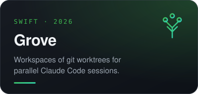
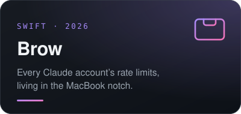
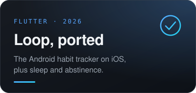

  

 

  I am co-founder and CEO of a company built around this idea. 
  For now you will not find it in these repositories.

  What you will find are some of the tools we use to work well in the age of AI.

  
  
  

 

  
  &nbsp;
  

