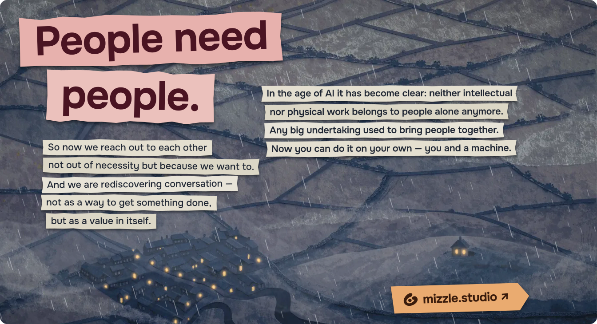
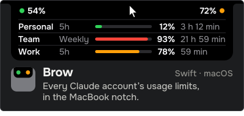
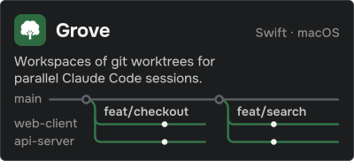
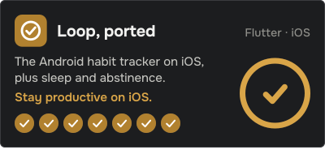

  

   
  

 

## Open source

Small tools I made and share with the developer community. Free for anyone&nbsp;to&nbsp;use.

<a href="https://github.com/efim0v/brow"><picture><source media="(min-width: 1240px)" srcset="assets/tool-brow-gap.svg" width="33.7494%"><source media="(min-width: 1012px)" srcset="assets/tool-brow-gap.svg" width="50.9549%"><source media="(min-width: 905px) and (max-width: 1011.98px)" srcset="assets/tool-brow-gap.svg" width="50.9549%"><source media="(min-width: 617px) and (max-width: 767.98px)" srcset="assets/tool-brow-gap.svg" width="50.9549%"></picture></a><a href="https://github.com/efim0v/grove"><picture><source media="(min-width: 1240px)" srcset="assets/tool-grove-gap.svg" width="33.7494%"><source media="(min-width: 1012px)" srcset="assets/tool-grove.svg" width="48.9951%"><source media="(min-width: 905px) and (max-width: 1011.98px)" srcset="assets/tool-grove.svg" width="48.9951%"><source media="(min-width: 617px) and (max-width: 767.98px)" srcset="assets/tool-grove.svg" width="48.9951%"></picture></a><a href="https://github.com/efim0v/uhabits"><picture><source media="(min-width: 1240px)" srcset="assets/tool-loop.svg" width="32.4513%"><source media="(min-width: 1012px)" srcset="assets/tool-loop.svg" width="48.9951%"><source media="(min-width: 905px) and (max-width: 1011.98px)" srcset="assets/tool-loop.svg" width="48.9951%"><source media="(min-width: 617px) and (max-width: 767.98px)" srcset="assets/tool-loop.svg" width="48.9951%"></picture></a>

